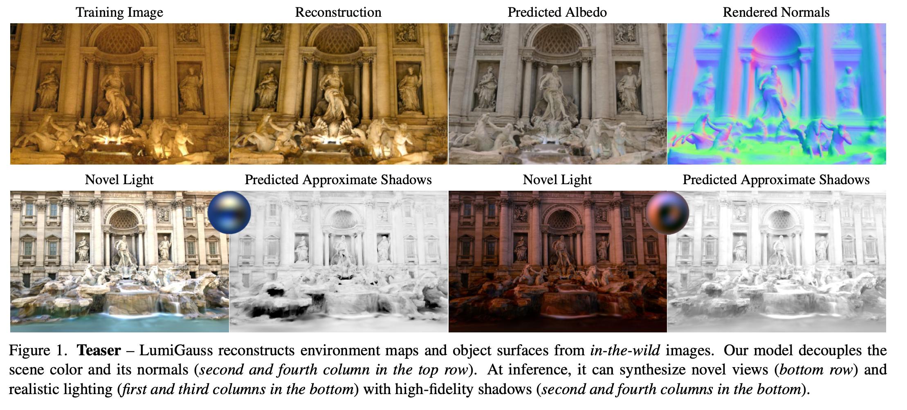
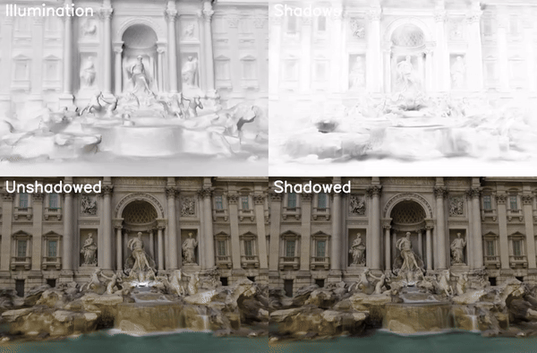

# LumiGauss

This is the official implementation of **LumiGauss: Relightable Gaussian Splatting in the Wild**, accepted at **WACV2025**.

[](https://arxiv.org/abs/2408.04474)
[](https://drive.google.com/drive/folders/1AvKkg0MMWPsftFXMPoeuV3jCkmox3XxN?usp=sharing)




<p align="center">
  
</p>

### Installation

Clone the Repository:
```bash
git clone https://github.com/joaxkal/lumigauss.git
cd lumigauss
```

Create the Environment:
```bash
conda env create --file environment.yml
conda activate lumigauss
```
The environment.yml file includes pinned versions of key dependencies. However, please note that certain packages may require adjustments depending on your specific CUDA version and GPU setup. 

For users on different hardware setups, it's possible to create a base environment using the original 2DGS repository and then manually install missing dependencies.

### Dataset

We use data from [NERF-OSR](https://github.com/r00tman/NeRF-OSR/tree/main). Required dataset structure:

```
data/
├── images/            # Undistorted images
├── masks/             # Corresponding masks
├── sparse/            # COLMAP sparse reconstruction data
└── lk2_split.csv      # Train/test split file
```

 `*_split.csv` format:
```
filename;split
02-05_19_30_DSC_2599.jpg;train
25-08_19_30_IMG_0421.JPG;test
...
```

### Usage
Refer to `run_all.sh` for scripts to train, render, and test. We provide two implementations: one using MLP and another with direct SH_env optimization. Initial tests showed significantly worse results with direct optimization, so the parameters were not further tuned. If you choose to use this version, additional fine-tuning may be required.


### Notes on testing
Use environment maps (JPG) and [test masks](https://github.com/r00tman/NeRF-OSR/issues/10) provided by NERF-OSR. We follow the evaluation protocol from [SOL-NERF](http://www.geometrylearning.com/SOL-NeRF/):

- Align the test environment map with scene reconstruction from COLMAP (match ground).
- Assume the environment map aligns with the ground; adjust only the **Y-axis rotation**.
- Estimate the sun direction using shadows and lighting in ground-truth images.
- Configure the test_config file for your alignment and angle setup. Render images within the guessed angle range.
- Evaluate results using PSNR and select the angle with the highest PSNR.

### Notes on sky synthesis

We don't optimize sky Gaussians separately; they are treated like other objects in the scene — oriented toward the camera and illuminated by the environment map. Training environment maps work well for sky synthesis because they are optimized for such sky orientation. However, using external maps may introduce artifacts. For more realistic synthesis, consider optimizing segmented sky regions independently.

### Acknowledgments

We acknowledge the following useful resources and repositories we built upon while developing LumiGauss:

- 2D Gaussian Splatting for Geometrically Accurate Radiance Fields  
https://github.com/hbb1/2d-gaussian-splatting

- NeRF for Outdoor Scene Relighting  
https://github.com/r00tman/NeRF-OSR
  
- Spherical Harmonics Repository  
https://github.com/chalmersgit/SphericalHarmonics

- Precomputed Radiance Transfer by Jan Kautz  
https://jankautz.com/courses/ShadowCourse/09-RadianceTransfer.pdf 

- Spherical Harmonic Lighting: The Gritty Details by Robin Green  
https://3dvar.com/Green2003Spherical.pdf

### Citation  
If you find this work useful, please cite
  ```bibtex
  @misc{kaleta2024lumigausshighfidelityoutdoorrelighting,
      title={LumiGauss: High-Fidelity Outdoor Relighting with 2D Gaussian Splatting}, 
      author={Joanna Kaleta and Kacper Kania and Tomasz Trzcinski and Marek Kowalski},
      year={2024},
      eprint={2408.04474},
      archivePrefix={arXiv},
      primaryClass={cs.CV},
      url={https://arxiv.org/abs/2408.04474}, 
}
  ``` 
